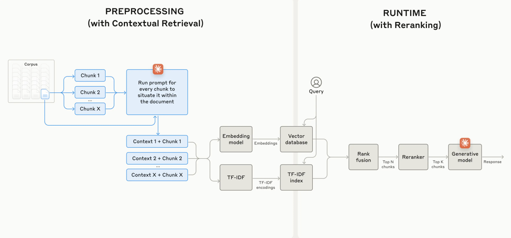

# Contextual RAG for Papers Understanding

Simple implementation of `Contextual RAG` from [Anthropic](https://www.anthropic.com/) for papers understanding task.



## Overview

Contextual Retrieval-Augmented Generation (RAG) enhances AI model responses by retrieving relevant information from extensive knowledge bases.

Traditional RAG methods often struggle to maintain context, but Contextual Retrieval addresses this issue by utilizing Contextual Embeddings and Contextual BM25, significantly improving retrieval accuracy.

A key technique involves prepending chunk-specific context to each data piece before embedding, ensuring that relevant information is preserved and accurately retrieved. Additionally, during the query process, results from Elasticsearch are reranked alongside semantic results to enhance contextual relevance.

More details can be found here: [link](https://www.anthropic.com/news/contextual-retrieval)

## To do:

-   [x] Upload all source code.
-   [] Build package for pip installation.

## Clone the repository

```bash
git clone https://github.com/hienhayho/papers-understanding-contextual-rag.git

cd papers-understanding-contextual-rag/
```

## Installation

```bash
pip install -r requirements.txt
```

## Run database

Setup QdrantVectorDataBase and ElasticSearch Database.

```bash
docker compose up -d
```

## Download papers

You can download some sample papers with:

```bash
bash scripts/download_papers.sh
```

> Note: You can add more .pdf papers to `papers` folder

## Ingest data

Ingest all papers content to database. By default, it will ingest both original RAG and contextual RAG.

```bash
bash scripts/contextual_rag_ingest.sh
```

> Note: Please refer to [scripts/contextual_rag_ingest.sh](scripts/contextual_rag_ingest.sh) to change the papers dir and RAG type to be ingested.

## Run demo

Add `--compare` to run the original RAG and Contextual RAG in parallel for comparison.

```bash
python demo_contextual_rag.py --q "What is ChainBuddy ?" --compare
```

## Basic Usage:

You can refer to [src/settings.py](./src/settings.py) to modify setting.

```python
from src.db import RAG
from src.settings import Settings

setting = Settings()

rag = RAG(setting)

q = "What is ChainBuddy ?"

print(rag.contextual_rag_search(q))
```
